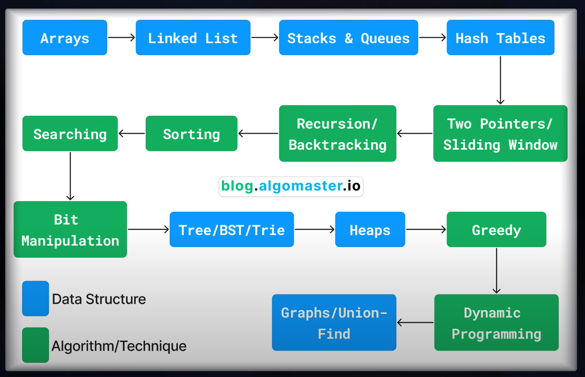

# Key DSA Topics for Interviews

## Core Areas

1. **Data Structures**
   - *Linear*: Array, String, Linked List, Stack, Queue, Hash Table
   - *Non-linear*: Tree, Graph, Binary Search Tree, Heap, Trie

2. **Algorithms**
   - Sorting, Binary Search, Bit Manipulation
   - Tree Traversal: In-order, Pre-order, Post-order, Level-order
   - Graph Traversal: DFS, BFS, Topological Sort, Dijkstra, Bellman-Ford

3. **Problem-Solving Techniques**
   - Two Pointers, Sliding Window, Prefix Sum, Fast & Slow Pointers
   - Divide and Conquer, Greedy, Recursion, Backtracking, Dynamic Programming, Top K Elements

> Focus on one topic at a time. Master the fundamentals, implement from scratch, and solve easy Leetcode problems before moving on.

---

## Recommended Learning Sequence

---

## How to Approach a New Topic

1. **Start with Basics**
   - What is it?
   - How is it represented in code?
   - What operations are supported?
   - Time and space complexities

2. **Explore Real-Life Applications**
   - Example: Dijkstra for Google Maps
   - Understand where and how DSA is used

3. **Visualize**
   - Use pen and paper for diagrams and pseudocode

4. **Implement from Scratch**
   - Reinforces understanding
   - Try implementing stacks with arrays and linked lists

5. **Learn Built-in Libraries**
   - E.g., Python's `heapq`, `collections`
   - Know available functions and when to use them

6. **Practice Easy Questions**

---

## Useful Resources

- Abdul Bari's YouTube channel (Algorithms)
- William Fiset's DS and Graph playlists
- Tushar Roy's Dynamic Programming playlist
- Coursera: Algorithms I & II

---

## Mastering a DSA Topic

1. Prioritize problem-solving over theory—application is key.
2. Challenge yourself: Easy → Medium → Hard.
3. Focus on logic and understanding, not memorization.
4. Use pen and paper to visualize.
5. Think in patterns—group and practice recurring techniques.

---

## Revision Strategy

1. Use repetition: Track problems in a spreadsheet and review weekly.
2. Maintain two Leetcode lists:
   - Revision 1: Problems you couldn't solve in one go
   - Revision 2: Problems you couldn't solve in Revision 1
3. Be consistent—mastery takes months.